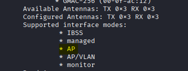
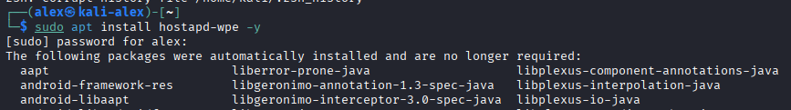
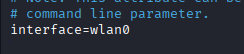
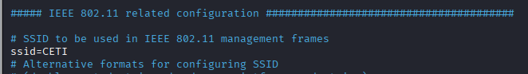
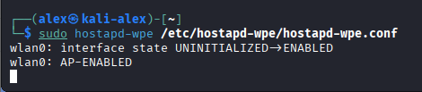
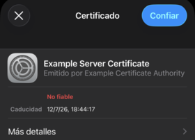
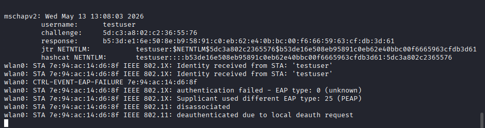
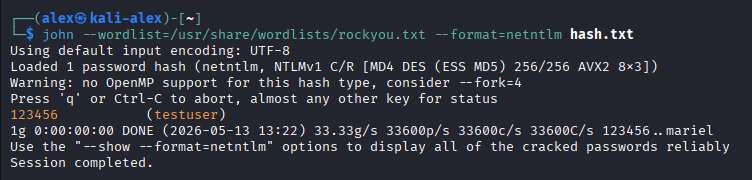

# PROYECTO: Ataque Evil Twin contra WPA2 Enterprise
**Asignatura:** Hacking Ético  
**Práctica:** 3 UD 2 - Proyecto
**Link Video** https://gvaedu-my.sharepoint.com/:v:/g/personal/aledomgis_alu_edu_gva_es/IQC23VYlzJtiSYoHniZjhiSaAZOQ5FE-5yXATnESB9myaaA?nav=eyJyZWZlcnJhbEluZm8iOnsicmVmZXJyYWxBcHAiOiJPbmVEcml2ZUZvckJ1c2luZXNzIiwicmVmZXJyYWxBcHBQbGF0Zm9ybSI6IldlYiIsInJlZmVycmFsTW9kZSI6InZpZXciLCJyZWZlcnJhbFZpZXciOiJNeUZpbGVzTGlua0NvcHkifX0&e=JdyUDc

---

## 1. Introducción
El objetivo es realizar una auditoría de redes Wifi mediante ataque Evil Twin. En este tipo de ataque, el objetivo es conseguir que la víctima se conecte a un punto de acceso malicioso que suplanta la red wifi de la empresa que usa WPA Enterprise con RADIUS

## 2. Información sobre la vulnerabilidad
**Tipo de ataque:** Rogue Access Point / Evil Twin.  
**Dificultad:** Alta.  
**Protocolos vulnerados:** 802.11, 802.1X, RADIUS, MSCHAPv2.

**Descripción:**
El ataque consiste en levantar un punto de acceso falso con el mismo nombre (SSID) que la red corporativa. Al forzar o engañar a los clientes para que se conecten a nuestro AP malicioso en lugar del legítimo, logramos capturar el challenge/response de MSCHAPv2 de los usuarios. De esta manera se podrían robar las credenciales de acceso al dominio mediante diccionario, ya que es habitual que el RADIUS valide las credenciales contra un Active Directory.

## 3. Herramientas Utilizadas
Para la realización de esta práctica he utilizado el siguiente entorno y hardware:

* **Atacante:** Kali Linux.
* **Hardware Wi-Fi:** Tarjeta Alfa Wireless USB3.0 AWUS036ACH 
* **Software de ataque:** `hostapd-wpe`.
* **Redes objetivo en el aula:** CETI

## 4. Escenario del laboratorio

| Rol | Sistema |
| :--- | :--- |
| **Atacante** | Kali Linux |
| **Víctima** | Dispositivo Móvil (iPhone 13) |

- Adaptador de red inalámbrico en modo Monitor/AP.
- Suplantación de red corporativa 802.1x.
- Interacción manual de la víctima ante alerta de certificado

## 5. Pasos para realizar el ataque

### Paso 1: Verificación de la tarjeta de red
Antes de iniciar, es obligatorio comprobar viendo la salida del comando `iw list` y observando si la tarjeta soporta modo AP. Esto es vital para que pueda funcionar como un punto de acceso malicioso.

```bash
# Comando para listar las capacidades de la interfaz
iw list | less
```


### Paso 2: Instalación de las herramientas necesarias
Para realizar la suplantación de la red corporativa y capturar los hashes, usaremos la herramienta hostapd-wpe (Wireless Pwnage Edition) disponible en los repositorios oficiales de Kali Linux.

```bash
# Comando para instalar hostapd-wpe
sudo apt update && sudo apt install hostapd-wpe -y
```


### Paso 3: Configuración del AP falso
Para que el ataque sea efectivo, nuestro punto de acceso debe suplantar exactamente la identidad de la red objetivo. Debemos editar el archivo de configuración de `hostapd-wpe` para establecer el SSID correcto (en nuestro caso, la red del aula `CETI`) y definir nuestra interfaz de red inalámbrica.

```bash
# Editamos el archivo de configuración principal
sudo nano /etc/hostapd-wpe/hostapd-wpe.conf
```




### Paso 4: Ejecución del ataque
Con el archivo configurado, procedemos a levantar nuestro punto de acceso falso. Al ejecutar el siguiente comando, nuestra tarjeta de red comenzará a radiar la red suplantada y la herramienta se quedará a la escucha, esperando que los clientes intenten autenticarse.

```bash
# Comando para lanzar el AP malicioso
sudo hostapd-wpe /etc/hostapd-wpe/hostapd-wpe.conf
```



### Paso 5: Conexión del cliente y alerta de seguridad en iOS

Para simular el ataque, utilizamos un dispositivo cliente (iPhone 13). El objetivo es que la víctima intente conectarse a nuestro punto de acceso falso, ya sea manualmente o de forma automática si tenía la red guardada previamente.

Al intentar establecer la conexión, el sistema operativo iOS detecta que el certificado del servidor RADIUS presentado por nuestra herramienta (`hostapd-wpe`) no coincide con el legítimo de la infraestructura corporativa. Por ello, corta temporalmente la conexión y muestra a la víctima una advertencia de **"Certificado no confiable"**. 

Para que el ataque continúe y la contraseña sea enviada, la víctima debe ser engañada y pulsar en **"Confiar"** (Trust).



### Paso 6: Captura del Challenge/Response (MSCHAPv2)

En el momento en que la víctima pulsa "Confiar" y acepta el certificado malicioso, el dispositivo envía sus credenciales. En la terminal del atacante podemos observar cómo se completa el proceso de autenticación.

La herramienta logra interceptar la comunicación y nos muestra por pantalla el nombre de usuario y los hashes capturados (*Challenge* y *Response* de MSCHAPv2). Además, nos proporciona directamente la estructura del comando (para `john` o `asleap`) que necesitaremos en la siguiente fase para crackear la contraseña.



## 6. Captura y obtención de credenciales (Crackeo)

A diferencia de un ataque web donde las credenciales pueden viajar en texto plano, en WPA2 Enterprise capturamos un hash (MSCHAPv2). Aunque el atacante no le proporcione internet a la víctima (y esta sufra un error de conexión), el hash ya ha sido comprometido. 

Para demostrar el riesgo real, vamos a realizar un ataque de diccionario offline para obtener la contraseña en claro.

### Paso 1: Preparación del Hash
La herramienta `hostapd-wpe` nos proporciona directamente la cadena de texto formateada para herramientas de crackeo. Copiamos la línea correspondiente a `jtr NETNTLM` y la guardamos en un archivo de texto llamado `hash.txt`.

```bash
# Guardamos el hash capturado en un archivo local
 echo 'testuser:$NETNTLM$5dc3a802c2365576$b53de16e508eb95891c0eb62e40bbc00f6665963cfdb3d61' > hash.txt
```

### Paso 2: Ejecución del ataque de diccionario con John The Ripper
Utilizamos la herramienta John The Ripper, indicándole el formato del hash (netntlm) y pasándole un diccionario de contraseñas comunes (en este caso, rockyou.txt predeterminado en Kali).

```bash
# Comando para crackear el hash
john --wordlist=/usr/share/wordlists/rockyou.txt --format=netntlm hash.txt
```
### Paso 3: Verificación de credenciales obtenidas
Como la contraseña utilizada por la víctima se encontraba dentro de nuestro diccionario, la herramienta logra calcular la colisión del hash en cuestión de segundos, mostrándonos la credencial en texto plano.

Con esto, se demuestra el compromiso total de la cuenta de dominio del usuario, permitiendo a un atacante acceder a la intranet y recursos corporativos de la organización.



## 7. Conclusiones y Medidas de Mitigación

El ataque realizado demuestra que, aunque WPA2-Enterprise es significativamente más seguro que WPA2-PSK, la seguridad del ecosistema depende de la correcta configuración tanto del servidor RADIUS como de los suplicantes (clientes). El éxito de un Evil Twin en este entorno se basa en la **validación inadecuada de certificados** por parte del usuario o del sistema operativo.

A continuación, se detallan las estrategias de mitigación desde tres enfoques distintos:

## A. Mitigaciones a Nivel de Infraestructura (Red)

1.  **Migración a EAP-TLS (Autenticación basada en Certificados):**
    * **Descripción:** Es el estándar de oro en seguridad Wi-Fi corporativa. En lugar de utilizar usuario y contraseña (PEAP-MSCHAPv2), cada dispositivo posee un certificado digital único.
    * **Efectividad:** Aunque un atacante suplante el SSID, no podrá completar el handshake de autenticación porque no posee la clave privada del certificado del servidor legítimo, y el cliente tampoco enviará credenciales que puedan ser crackeadas por diccionario.
2.  **Sistemas de Prevención de Intrusiones Inalámbricas (WIPS):**
    * **Descripción:** Desplegar sensores que monitorean el espectro radioeléctrico en busca de anomalías.
    * **Efectividad:** Un WIPS detecta automáticamente la aparición de un AP con el mismo SSID (Rogue AP) o con una dirección MAC no autorizada, pudiendo lanzar ataques de desautenticación automáticos contra el AP malicioso para neutralizarlo.
3.  **Protección de Tramas de Gestión (802.11w):**
    * **Descripción:** Cifra las tramas de gestión (como los paquetes de desautenticación).
    * **Efectividad:** Dificulta que el atacante fuerce a los clientes a desconectarse del AP legítimo para que se unan al Evil Twin.

## B. Mitigaciones a Nivel de Dispositivo Final (Endpoint)

1.  **Fijación de Certificados mediante MDM o GPO:**
    * **Descripción:** Utilizar sistemas de gestión (como Intune, Jamf o políticas de grupo en Windows) para pre-configurar el perfil Wi-Fi en los dispositivos.
    * **Efectividad:** Se fuerza al dispositivo a confiar **exclusivamente** en la huella digital (thumbprint) del certificado del servidor RADIUS legítimo. Esto elimina la posibilidad de que el usuario vea el aviso de "Confiar" y pueda aceptarlo manualmente; el dispositivo simplemente rechazará la conexión.
2.  **Desactivación de la Autoconexión (Auto-Join):**
    * **Descripción:** Configurar los dispositivos para que no se conecten automáticamente a redes conocidas.
    * **Efectividad:** Reduce la superficie de exposición, ya que el dispositivo no intentará el intercambio de identidad en segundo plano al detectar el SSID suplantado.

## C. Mitigaciones Organizacionales (Factor Humano)

1.  **Programas de Security Awareness:**
    * **Descripción:** Formación continua sobre ingeniería social y seguridad inalámbrica.
    * **Efectividad:** Un usuario entrenado reconocerá que un aviso de "Certificado no confiable" en una red que usa a diario es una señal de alerta crítica y notificará al departamento de IT en lugar de pulsar "Confiar".
2.  **Política de Contraseñas Robustas:**
    * **Descripción:** Forzar el uso de contraseñas de alta complejidad y longitud.
    * **Efectividad:** Dado que el ataque MSCHAPv2 capturado requiere un crackeo por diccionario o fuerza bruta, una contraseña robusta hace que el tiempo y los recursos necesarios para obtenerla en claro sean inviables para el atacante.
